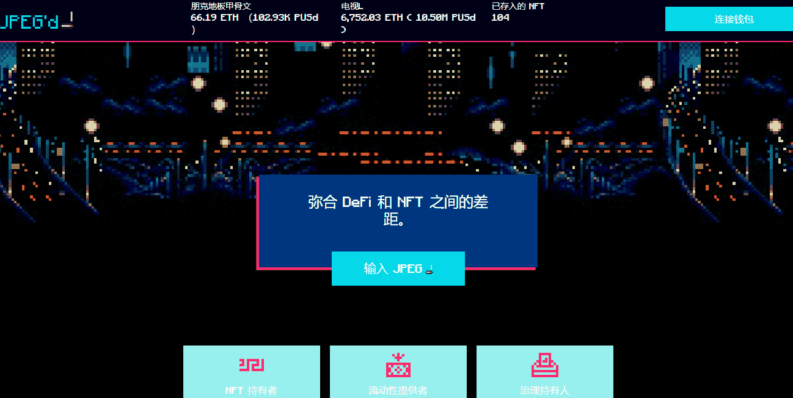

# JPEG Cards

▶ 什么是 JPEG 卡？
JPEG Cards 是一个 NFT（不可替代令牌）集合。存储在区块链上的数字艺术品集合。
▶ JPEG Cards 代币有多少？
总共有 1,018 个 JPEG Cards NFT。目前，426 位所有者的钱包中至少有一张 JPEG Cards NTF。
▶ 什么是最昂贵的 JPEG Cards 销售？
出售的最昂贵的 JPEG Cards NFT 是 JPEG Card 769。它于 2022 年 7 月 2 日（2 个月前）以 1.21 万美元的价格售出。
▶ 最近卖出了多少张 JPEG 卡？
过去 30 天内售出了 44 张 JPEG Cards NFT。
▶ 一张 JPEG 卡的价格是多少？
在过去 30 天内，最便宜的 JPEG Cards NFT 销售额低于 236 美元，最高销售额超过 10.9 万美元。过去 30 天 JPEG Cards NFT 的中位价格为 678 美元。

