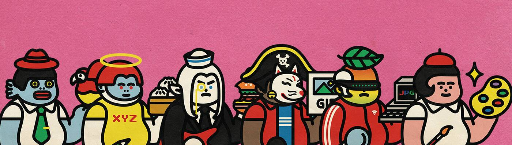

# Josh Pierce - Peace

**乔什·皮尔斯数据**

创建于 1 年多前，1,360 代币供应，10% 费用

过去 7 天没有出售 Josh Pierce。

Nifty Gateway 的 Josh Pierce 的系列。 皮尔斯专注于超现实和自然主题，通过他对色彩和构图的崇高运用唤起敬畏感和精神平静。他的主要主题将自然环境与抽象的能量形式并置，以暗示此时此地之外的存在。他目前在洛杉矶担任艺术总监，与无数知名客户合作，包括 Adobe、Elastic、NFL 和格莱美奖获奖艺术家 Rodrigo y Gabriela。

为什么我们喜欢乔什·皮尔斯
尽管是城市世界，但静止、人类心灵和自然的重要性。 这位艺术家巧妙地将大自然日常进程中令人惊叹的时刻的背景动画化。 结果是一系列具有足够深度且不乏大胆的图形。 在某种程度上，皮尔斯的冥想和云的图像都因其对自然世界的吸引力而成为引人注目的主题。 我们发现自己滑入放松和正念思考。

