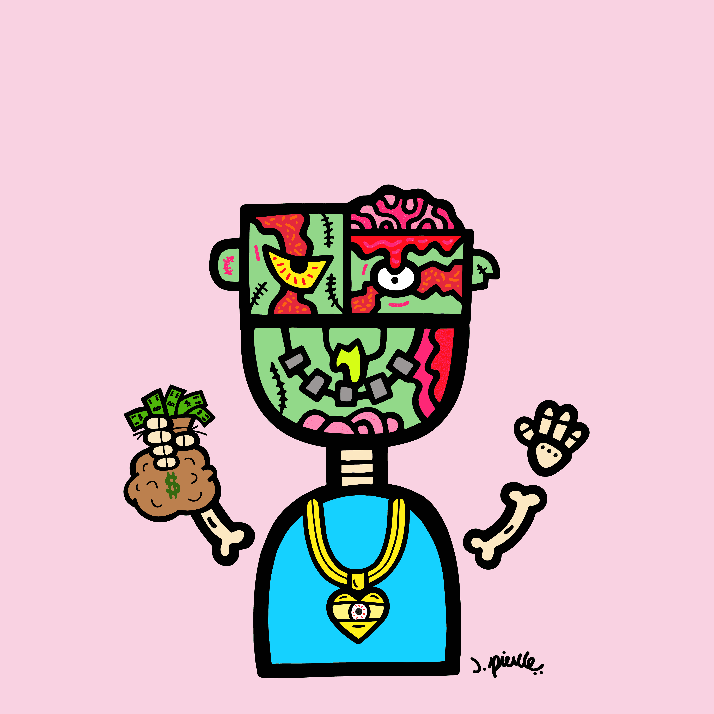

# J. Pierce Zombie Friends

J. Pierce Zombie Friends NFT 在过去 7 天内售出 9 次。J. Pierce Zombie Friends 的总销售额为 322.41 美元。J. Pierce Zombie Friends NFT 的平均价格为 35.8 美元。共有 385 名 J. Pierce Zombie Friends 拥有者，总共拥有 1,412 个代币。

J. Pierce & Friends Zombie Friends 是艺术家 Justin Pierce 的扩展作品，J. Pierce & Friends 的作者。**商业权利**授予所有者。**我们正在向有发育障碍的Best Buddies**儿童捐款。

此外，在销售期间还将向具有特殊背景的人赠送 14 ETH，其中包括向最终买家赠送 3 ETH。前 4,000 个将赠送给第一个 4,000 个收藏的持有者。

J. Pierce 是一位艺术家，曾在 Jimmy Kimmel 秀上亮相，他的客户包括 Samuel L. Jackson、LeBron James、Rick Ross、LL Cool J. 等等。他从 Keith Haring、Andy Warhol 和 Theodor Dr. Seuss Geisel 等艺术家那里汲取灵感。

加入我们的 20,000 名成员 Discord 社区，并获得由艺术家签名的真实实物艺术以及原始源艺术的赠品！

特许权使用费也会定期赠送给业主。

