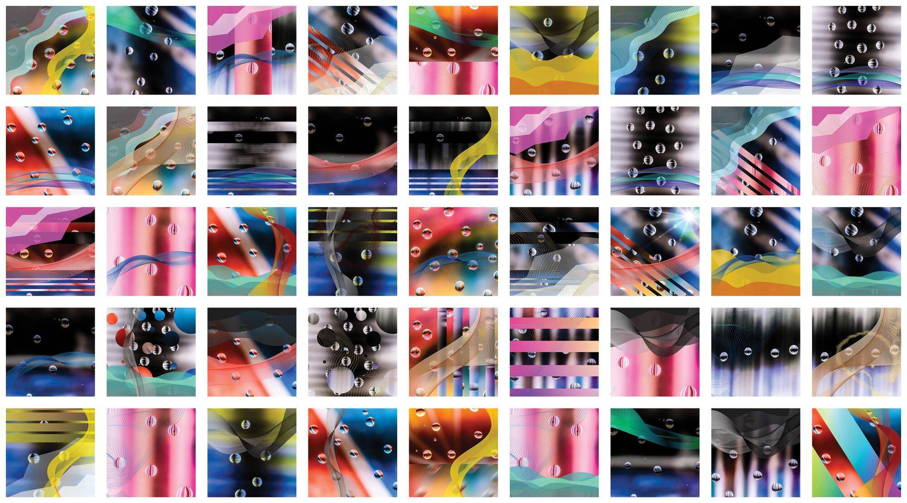

# JRF-MICA

JRF-MICA 是 James Richard Fry 的多媒体生成艺术系列。 粉笔水玻璃矢量生成 1,111 个独特的部分。

**所有原始创世纪铸币者都会收到与他们的 NFT 相关的 18X24 艺术品，装裱并签名。**

**JRF-云母 #428**

拥有者 [机械师01]

*能见度*：13 次观看

*日程*：销售将于 2022 年 9 月 13 日下午 4:31 GMT+8结束 

JRF-MICA James Richard Fry 的 4 个中等生成艺术系列。

**JRF-云母 #408**

拥有者 [尖顶01]

*能见度*：6 次观看

*日程*：销售将于 2022 年 9 月 14 日上午 11:25 GMT+8结束 

JRF-MICA James Richard Fry 的 4 个中等生成艺术系列。

