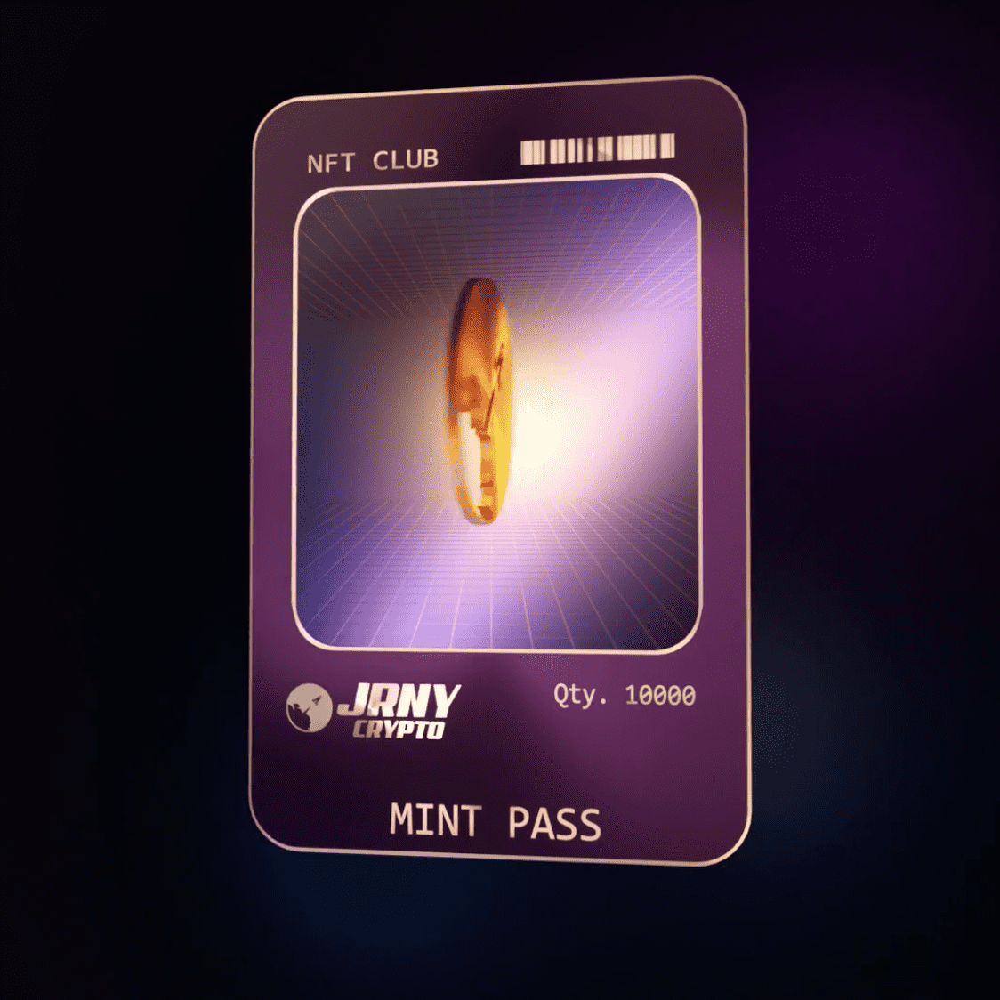

# JRNY Club Reward Collection

**JRNY俱乐部统计**

创建于 9 个月前

10	,000 代币供应

OpenSea 验证集合

7.5% 费用

73,536 名 Discord 成员

刷新

JRNY Club NFT 在过去 7 天内售出 158 次。JRNY Club 的总销售额为 12.271 万美元。一个 JRNY Club NFT 的平均价格为 776.6 美元。共有 5,851 名 JRNY 俱乐部所有者，拥有 10,000 个代币的总供应量。

JRNY Club 是会员制 NFT，授予对未来集合的访问权限、私人社区访问权限、独家 NFT 视频、早期访问合作伙伴 NFT 项目等。

JRNY Club NFT - 常见问题（FAQ）
▶ 什么是 JRNY 俱乐部？
JRNY Club 是一个 NFT（非同质代币）集合。存储在区块链上的数字艺术品集合。
▶ JRNY Club 代币有多少？
总共有 10,000 个 JRNY Club NFT。目前，5,851 位车主的钱包中至少有一个 JRNY Club NTF。
▶ JRNY Club 最贵的促销是什么？
售出的最昂贵的 JRNY Club NFT 是 VOYAGER #505。它于 2022 年 6 月 4 日（3 个月前）以 140 美元的价格售出。
▶ 最近卖出了多少 JRNY Club？
过去 30 天内售出了 396 个 JRNY Club NFT。
▶ JRNY 俱乐部的费用是多少？
在过去 30 天里，JRNY Club NFT 最便宜的销售额低于 640 美元，最高销售额超过 1233 美元。过去 30 天 JRNY Club NFT 的中位价格为 877 美元。
▶ 什么是流行的 JRNY 俱乐部替代品？
许多拥有 JRNY Club NFT 的用户还拥有 Villagers of XOLO、 JRNY Club Rewards Collection、 XOLO Keys和 The Goobers。

