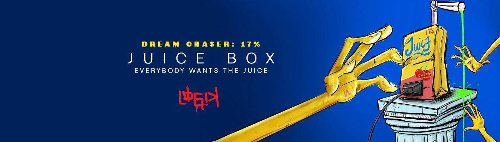

# Juice Box by LOGIK

我们想要真正的东西而不是假的东西。[从饮用高果糖玉米糖浆饮料到 100% 果汁] - 果汁盒象征着孩子般的奇迹，鼓励我们保持对世界的好奇心，感受无限可能。在生活中，很容易陷入系统性障碍、家庭期望或社会规范的困境。果汁是指成功和繁荣所需的技能和社会关系。当生活在你的真实生活中并在你的个人旅程中取得进展时，你的果汁是通往思维扩展体验的通行证，这反过来又可以激励你的家人和社区。- Juice Box 项目是对食物沙漠和针对低收入社区黑人社区的营销的社会评论。[在 Juice Box 的信息中查找其余描述]

