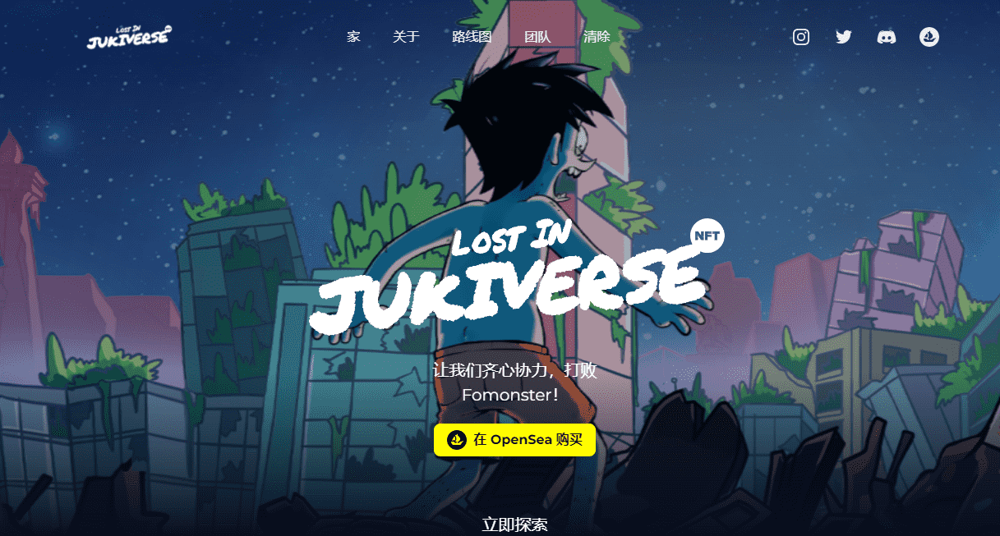

# Si Juki: Lost in Jukiverse

Si Juki是Faza Meonk于2010年创作的印尼流行漫画人物。司巨基的故事最初是在社交媒体上发布的网络漫画，后来以印刷漫画、网络漫画、手机游戏、连环动画、动画电影等多种媒体形式发布。

目前，Juki 已经出版了 50 多本畅销书，遍布印尼书店。此外，Juki 还与 Spongebob Squarepants（美国）、Larva（韩国）和 BoboiBoy（马来西亚）等国际角色合作。

作为一部电影，Juki 已被改编成名为“Si Juki The Movie: Panitia Hari Akhir”的电影以及Disney+ Hotstar 系列“Si Juki Anak Kosan”。Juki还与西班牙LaLiga、LINE、Sony Playstation、AIA等上百个品牌合作。

