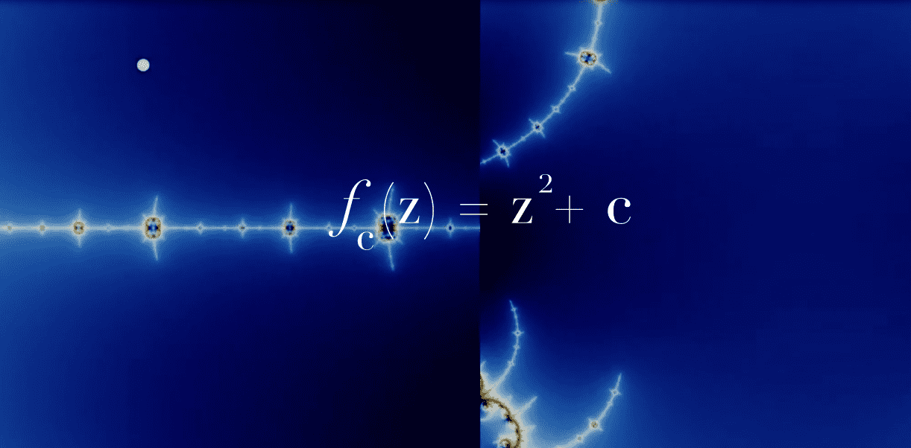

# Julia Set Collection

这些艺术品是用数值算法生成的，并刻在 4200 个独特的 NFT 中。每件作品都代表了我们最喜欢的 Julia 点之一的邻域，对应于 Mandelbrot 集合集合中心的点 C。Julia 的缩放因子是 Mandelbrot 缩放的对数，并根据函数 f(z) = z^2 + c 发散到无穷大的迭代速度以相似的梯度着色。请记住：金色点非常稀缺。Abramo 实现了 128 个视频片段，以及[Maths Town](https://www.youtube.com/c/MathsTown)创建的 66 个视频和 50 个图像。您可以在我们的网站上获取更多信息并铸造一个新的、随机选择的 Julia

