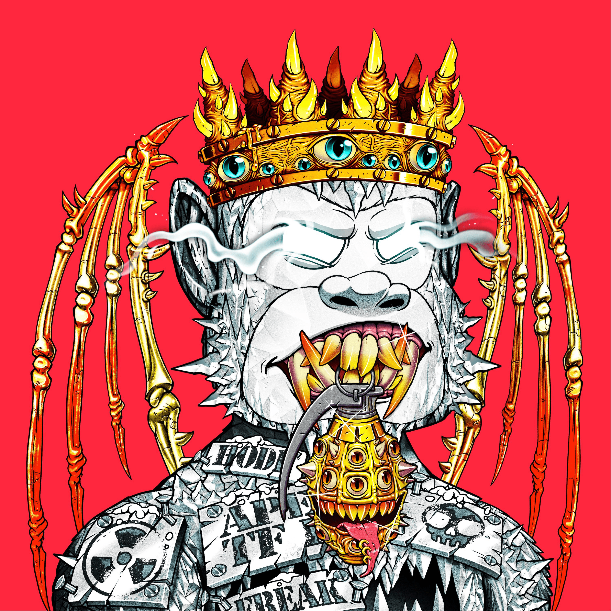

# Jungle Freaks Motor Club JFMC

Jungle Freaks Motor Club NFT 在过去 7 天内售出 20 次。Jungle Freaks Motor Club 的总销售额为 747.74 美元。Jungle Freaks Motor Club NFT 的平均价格为 37.4 美元。有 2,722 名 Jungle Freaks Motor Club 车主，总共拥有 8,888 个代币。

8,888 辆手绘汽车的集合。5 种不同的体型，具有 350 多种独特的特征。NFT 充当具有嵌入式性能相关元数据的汽车相关游戏的元节通行证。

丛林怪胎汽车俱乐部 NFT - 常见问题 (FAQ)
▶ 什么是丛林怪胎汽车俱乐部？
Jungle Freaks Motor Club 是一个 NFT（非同质代币）系列。存储在区块链上的数字艺术品集合。
▶ 有多少 Jungle Freaks Motor Club 代币？
总共有 8,888 个 Jungle Freaks Motor Club NFT。目前，2,722 名车主的钱包中至少有一本 Jungle Freaks Motor Club NTF。
▶ Jungle Freaks Motor Club 最昂贵的促销活动是什么？
最昂贵的 Jungle Freaks Motor Club NFT 是 JFMC-7512。它于 2022-06-05（3 个月前）以 272.9 美元的价格售出。
▶ 最近卖出了多少丛林怪胎汽车俱乐部？
过去 30 天内共售出 54 个 Jungle Freaks Motor Club NFT。
▶ 丛林怪胎汽车俱乐部的费用是多少？
在过去 30 天内，最便宜的 Jungle Freaks Motor Club NFT 销售额低于 9 美元，最高销售额超过 110 美元。过去 30 天内，Jungle Freaks Motor Club NFT 的中位价格为 13 美元。
▶ 有哪些流行的 Jungle Freaks Motor Club 替代品？
许多拥有 Jungle Freaks Motor Club NFT 的用户还拥有 JUNGLE FREAKS GENESIS、 Fallout Crystals、 Fallout Freaks Official Collection和 JUNGLE FREAKS GENESIS。

