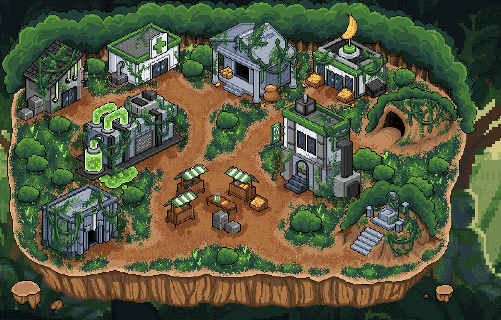

# CyberGorilla JungleSerum

一个由 3333 名 CyberGorillas 组成的部落在丛林中秘密工作，以开发强大的 JungeSerum。 食用后，将生产一个 Baby CyberGorilla。 我们 P2E 生态系统的一部分。您的 NFT 可能会在智能合约中质押时积累实用代币（“GRILLA”）。 除了 Cyber Gorillas 生态系统之外，GRILLA 没有其他功能，并且不能从 Cyber Gorillas Developers 购买。 Cyber Gorillas 开发商不提供也不打算为 GRILLA 提供二级市场。

CyberGorilla JungleSerum NFT - 常见问题（FAQ）
▶ 什么是 CyberGorilla JungleSerum？
CyberGorilla JungleSerum 是一个 NFT（Non-fungible token）集合。存储在区块链上的数字艺术品集合。
▶ 有多少 CyberGorilla JungleSerum 代币？
总共有 1 个 CyberGorilla JungleSerum NFT。目前，30 位所有者的钱包中至少有一个 CyberGorilla JungleSerum NTF。
▶ 最近卖出了多少 CyberGorilla JungleSerum？
过去 30 天内共售出 0 个 CyberGorilla JungleSerum NFT。

