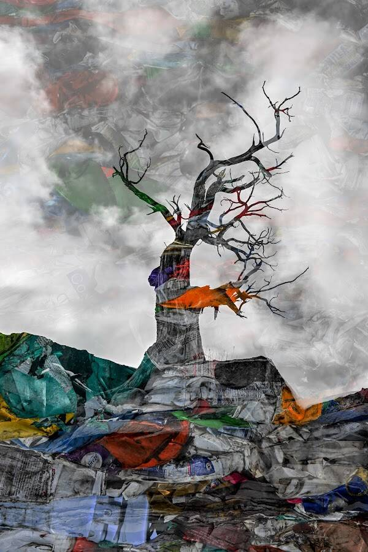

# Junipers Last Gasp

Juniper's Last Gasp 及其信息超越了这棵特定的树，因为它分享了不断增长的威胁的故事，这些威胁包括我们的水域、陆地、空气和居住在我们 🌎 星球上的生物。

杜松树在最荒凉的条件下茁壮成长。杜松可以承受令人毛骨悚然的低温、酷热和强风。即使水很少，它的根也会找到解渴的方法。据说杜松的寿命从 400 年到 1000 年不等。想象一下这些树在我们面前见证了多少？

沿着弯曲的道路行驶在科罗拉多国家纪念碑上时，一棵光秃秃的、没有叶子的、毫无生气的杜松从悬崖上站出来对我大喊大叫。“看着我，你没看见吗！”

我开车经过那个弯道，但关于那棵黑暗而死去的杜松的一些东西一直在我的潜意识里萦绕。

我继续往前开，但我的大脑在和我玩耍，闪现那棵树的形象。我猛地把车停了下来，然后决定转回下坡。狭窄的道路很难停在路边，但我打开了危险灯并抓住了我的相机。一两分钟，我设法从树所环绕的岩层下方拍摄了几张照片。最后，那棵杜松树得到了应有的关注。

我几乎不知道这张照片有时会通过我的摄影分享信息。它确实做到了。

两周后，我到步行山科学中心组织的垃圾填埋场和回收设施进行了实地考察。我带上了相机，拍了很多照片，知道我可能会从那次旅行中得到一个照片故事。几张照片是压缩的回收♻️材料，大部分是空塑料瓶和容器。

在下载照片之前，我开始探索我相机的一些不熟悉和未使用的功能；我注意到“相机内叠加”的标签。对这个选项感到好奇，我合并了两张照片，使用了死杜松和压实的再生塑料堆的照片。

繁荣！这张图跳出来了！标题对我来说清楚而准确。“杜松的最后一口气。” 这棵树对我有一个信息，一种耳语，分享它的故事。虽然随着时间的推移，它可以并且可能承受所有恶劣的天气和挑战，但如果我们不关心我们的环境，即使是不屈不挠的杜松也会灭亡。

