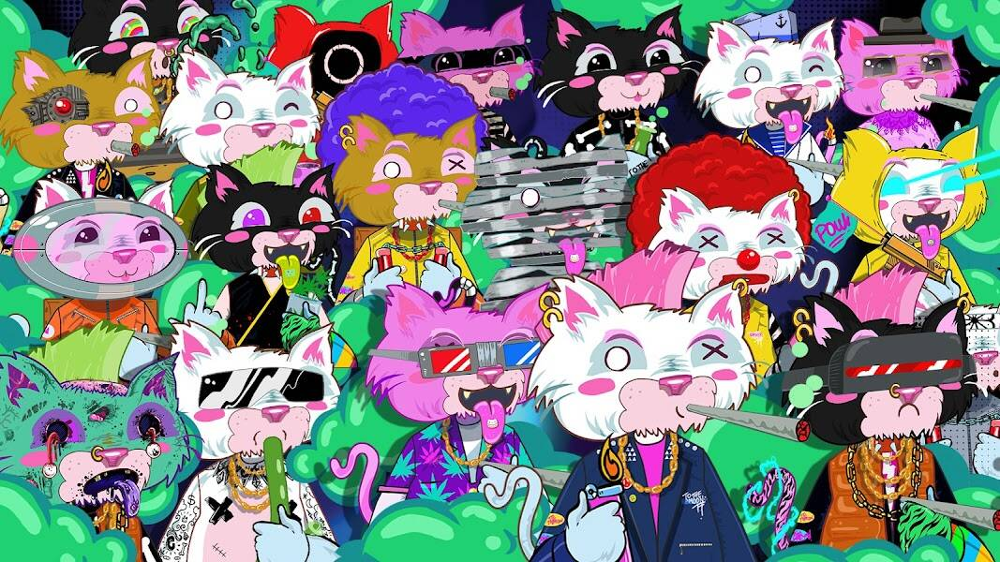

# Junkie Catz

多边形区块链上的 4444 个 DE 生成头像。Junkie Catz 是对一些不幸的猫科动物爱好者的创造性艺术描绘 - 由 NFT 狂热者团队创作。

这件艺术品在 Polygon Network 上铸造，独一无二，讲述了一群曾经普通的家猫如何变得堕落、上瘾、吸毒者 Catz 的戏剧性故事。

拥有一只吸毒猫不仅仅是为了拥有一件稀有的数字艺术或个性化的头像，当然这是其中的一部分，但实际上它是为了获得一个充满活力和成功的社区。

Junkie Catz NFT - 常见问题（FAQ）
▶ 什么是吸毒者卡茨？
Junkie Catz 是一个 NFT（不可替代令牌）集合。存储在区块链上的数字艺术品集合。
▶ 有多少 Junkie Catz 代币？
总共有 448 个 Junkie Catz NFT。目前，208 位车主的钱包中至少有一个 Junkie Catz NTF。
▶ 最近卖了多少 Junkie Catz？
过去 30 天内售出 0 个 Junkie Catz NFT。

