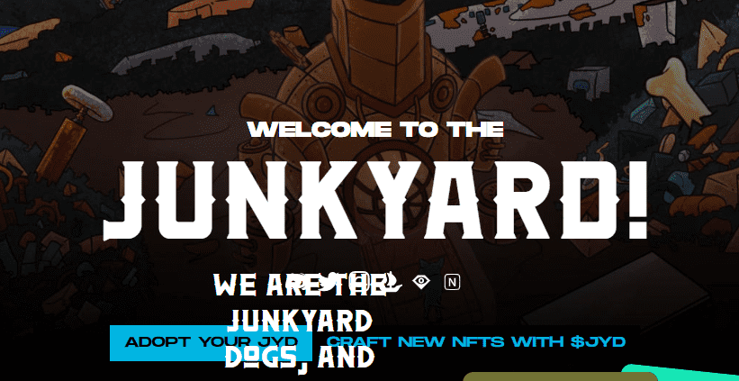

# JunkYard Pumpkin Pass

这一年是 2049 年。人类社会的残余物散落在这片土地上。来自未来的消息警告即将发生猫科动物起义。现在是狗动员起来并为即将发生的事情做好准备的时候了。

我们是垃圾场狗，这就是我们的故事开始的地方。

JunkYard Pumpkin Pass NFT - 常见问题（FAQ）
▶ 什么是垃圾场南瓜通行证？
JunkYard Pumpkin Pass 是一个 NFT（非同质代币）集合。存储在区块链上的数字艺术品集合。
▶ 有多少 JunkYard Pumpkin Pass 代币？
总共有 1 个 JunkYard Pumpkin Pass NFT。目前，111 位业主的钱包中至少有一张 JunkYard Pumpkin Pass NTF。
▶ 最近卖了多少垃圾场南瓜通行证？
过去 30 天内售出 0 个 JunkYard Pumpkin Pass NFT。

