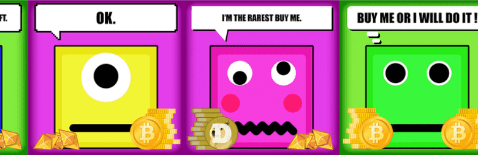

# Just A Square OFFICIAL

只是一个正方形是 2000 个正方形的惊人集合！起初区块链只是正方形。加入我们和薄荷。没有路线图，没有公用事业，但我们的持有者有很多惊喜

Just A Square 官方 NFT - 常见问题 (FAQ)
▶ 什么是 Just A Square OFFICIAL？
Just A Square OFFICIAL 是一个 NFT（非同质代币）集合。存储在区块链上的数字艺术品集合。
▶ 有多少 Just A Square OFFICIAL 代币？
总共有 1,047 个 Just A Square 官方 NFT。目前，120 位所有者的钱包中至少有一个 Just A Square OFFICIAL NTF。
▶ 最昂贵的 Just A Square 官方促销是什么？
售出的最昂贵的 Just A Square OFFICIAL NFT 是 Just A Square #382。它于 2022-06-21（2 个月前）以 5.5 美元的价格售出。
▶ Just A Square OFFICIAL 最近卖出了多少？
过去 30 天内售出了 15 个 Just A Square OFFICIAL NFT。
▶ Just A Square OFFICIAL 的费用是多少？
过去 30 天，最便宜的 Just A Square OFFICIAL NFT 销售额低于 3 美元，最高销售额超过 5 美元。过去 30 天内，Just A Square OFFICIAL NFT 的中位价格为 4 美元。
▶ 什么是流行的 Just A Square OFFICIAL 替代品？
许多拥有 Just A Square OFFICIAL NFT 的用户还拥有 RR 1 ETH FLOOR、 Memphis Cats、 meta_ghost_pass和 Momo Pissing on You！.

