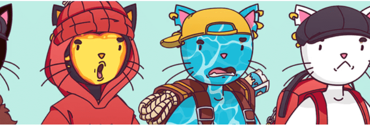

# Just Meow.

只是喵。8,888 只可爱喵喵的集合，带我们回到基础。没有绒毛，所有的价值。

只是喵。NFT - 常见问题（FAQ）
▶ 什么是Just Meow。？
只是喵。是一个 NFT（不可替代代币）集合。存储在区块链上的数字艺术品集合。
▶ 多少只喵。代币存在吗？
总共有 5,755 个 Just Meow。NFT。目前，364 位业主至少拥有一只 Just Meow。NTF 在他们的钱包里。
▶ 什么是最贵的 Just Meow。销售？
最贵的只是喵。出售的 NFT 是 Just Meow #5382。它于 2022-06-11（3 个月前）以 5.9 美元的价格售出。
▶ 多少只喵。最近有卖吗？
有2只喵。过去 30 天内售出的 NFT。

