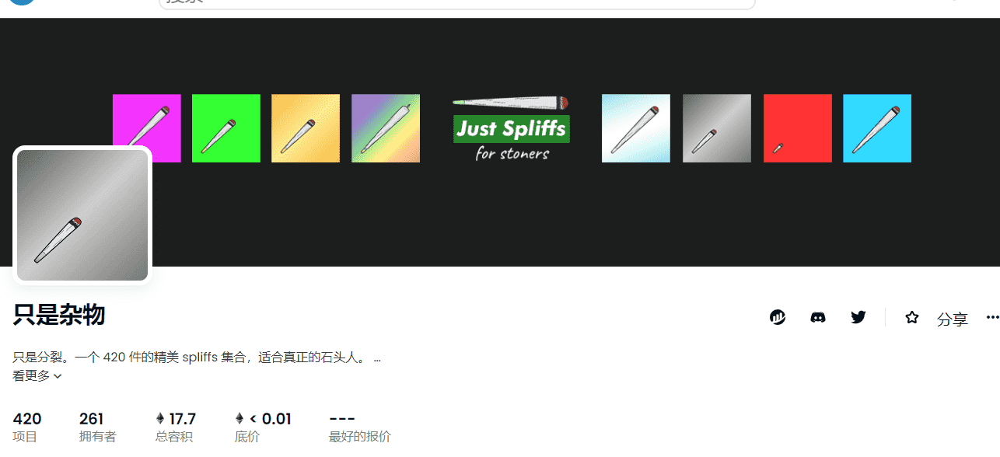

# Just Spliffs

我们制作了 spliffs 作为生活就像吸食杂草的真实表现。没有有趣的事情或胡说八道，只是一些普通的石头人可以欣赏的好东西，在以太坊区块链上永远燃烧。

▶ 什么是Just Spliffs？
Just Spliffs 是一个 NFT（非同质代币）集合。存储在区块链上的数字艺术品集合。
▶ 有多少 Just Spliffs 代币？
总共有 420 个 Just Spliffs NFT。目前，261 位所有者的钱包中至少有一个 Just Spliffs NTF。
▶ 最近卖出了多少 Just Spliffs？
过去 30 天内售出 0 个 Just Spliffs NFT。

