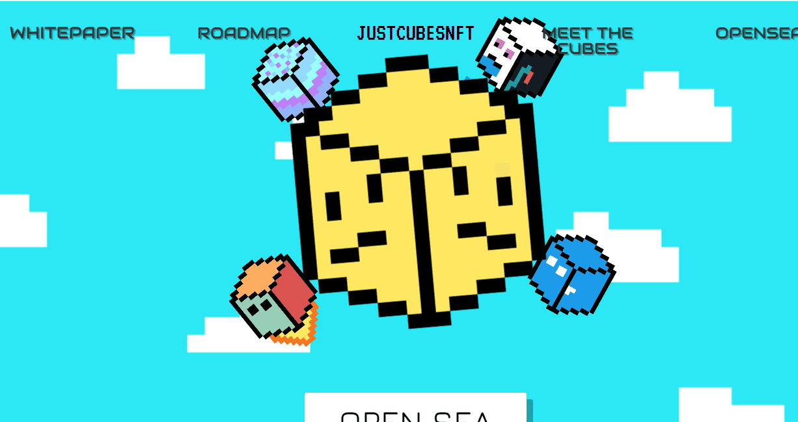

# JustCubesNFT

重温最怀旧的游戏，在享受私人节点访问的同时赢得史诗般的奖品。跟踪鲸鱼，分析可以访问 Nansen 的项目，并改善您的投资。警告：这些图像可能会引发光敏性癫痫患者的癫痫发作。建议观众酌情决定。

由 Just Cubes LLC™ 创建的 4444 个 Just Cubes NFT，用于动摇元宇宙并改变在项目背后拥有实用程序的意义。我们的社区不仅是作为投资者和交易者提升自己的地方，也是一个聚会的地方，并在空间内建立真正的联系。

