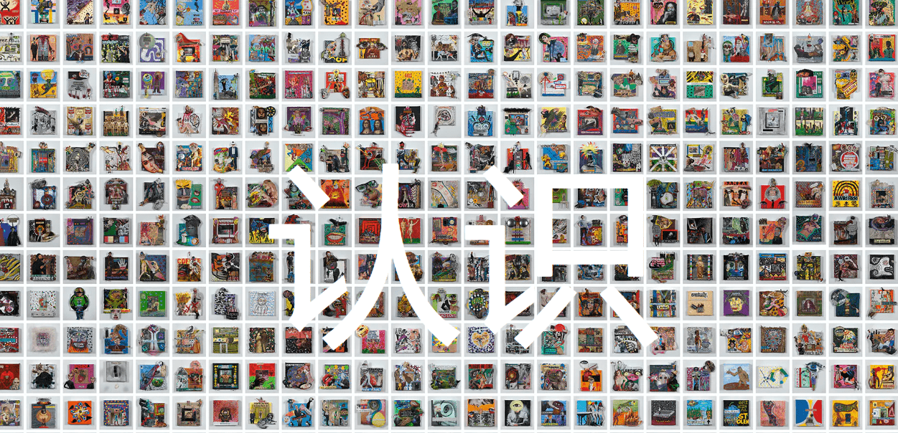

# Justin Aversano - Cognition - Collection of 364 Paintings

纽约，纽约，2022 年 8 月 8 日）—— 曼哈顿上空的维纳斯很高兴地宣布贾斯汀·阿维萨诺：认知，这是与开拓性艺术家和摄影师前所未有的合作。Aversano 去年凭借他的摄影 NFT 收藏 Twin Flames 登上了头条，它打破了拍卖记录，并促进了庞大的摄影 NFT 收藏家社区的发展。Cognition 扩展了 Aversano 对区块链技术的实验，围绕无常、物理存在和审美姿态的生命周期进行预期。

Cognition 由 365 个 NFT 组成，每个 NFT 对应于 Aversano 创作的一幅实物画。所有 365 幅画作都已数字化为 3D 模型，这些模型将在 mint.justinaversano.com 上的以太坊区块链上作为 NFT 铸造。

