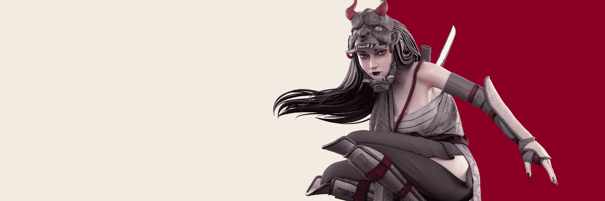

# KAHIRU NFT Official Collection Presale

KAHIRU 是和谐、耐心，甚至是运气。

质押是实时的；持有人数量不准确 - 超过 4.3k NFT 被质押。

由 Hodei Piquer 数字雕刻的 7222 个化身。每个人都属于统治 Ruy 星球的 5 个派系之一。该艺术品结合了 3D 动漫风格和每个角色的独特细节。

Kahiru NFT - 常见问题（FAQ）
▶ 什么是 Kahiru？
Kahiru 是一个 NFT（不可替代代币）集合。存储在区块链上的数字艺术品集合。
▶ Kahiru 代币有多少？
总共有 7,222 个 Kahiru NFT。目前，1,717 位所有者的钱包中至少有一个 Kahiru NTF。
▶ 最昂贵的 Kahiru 销售是什么？
出售的最昂贵的 Kahiru NFT 是 Kahiru Unrevealed #1123。它于 2022-06-07（3 个月前）以 448 美元的价格售出。
▶ 最近卖出了多少个 Kahiru？
过去 30 天内售出了 572 个 Kahiru NFT。
▶ Kahiru 多少钱？
在过去 30 天里，最便宜的 Kahiru NFT 销售额低于 44 美元，最高销售额超过 148 美元。Kahiru NFT 在过去 30 天内的中位价格为 73 美元。
▶ 什么是流行的 Kahiru 替代品？
许多拥有 Kahiru NFT 的用户还拥有 Blvck Genesis、 Mindblowon V2、 Lofi Originals和 BBRC-IVY BOYS。

