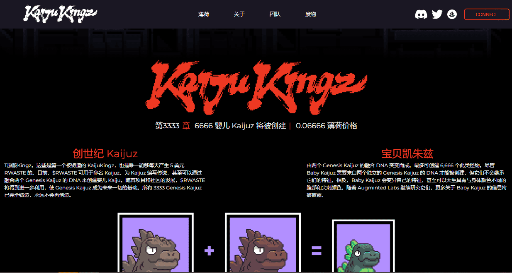

# Kaiju Kingz

看KaijuKingz；比生命还大的像素野兽正在摧毁你附近的一座城市。我们的信条是通过支持希望打入 NFT 的才华横溢的创意人员和开发人员来扩展 Metaverse。$RWASTE 辐射在我们社区的核心，由 Genesis Kaijuz 作为输出 Kaijuz 的燃料被动生成。拆除旧的为一种新的社区——Kingz 社区让路。KaijuKingz 是 CyberKongz 持有者和社区成员 OhDots 在他新成立的公司 Augminted Labs 的头脑中产生的。KaijuKingz 希望通过促进 Web3 社区之间竞争和协作的协同机制来扩展其社区。

该系列将从铸币厂 3,333 枚 Genesis Kaijuz 开始，每枚均授予其持有人特殊特权和访问权限。创世纪 Kaijuz 被动产生放射性废物，可用于制造 Baby Kaijuz。Kaijuz 在一个 69x69 像素的正方形中比生命更大，将具有各种各样的特征、类型和不同的美学。持有 Genesis Kaiju 将保留您作为 Metaverse 之王的宝座。

