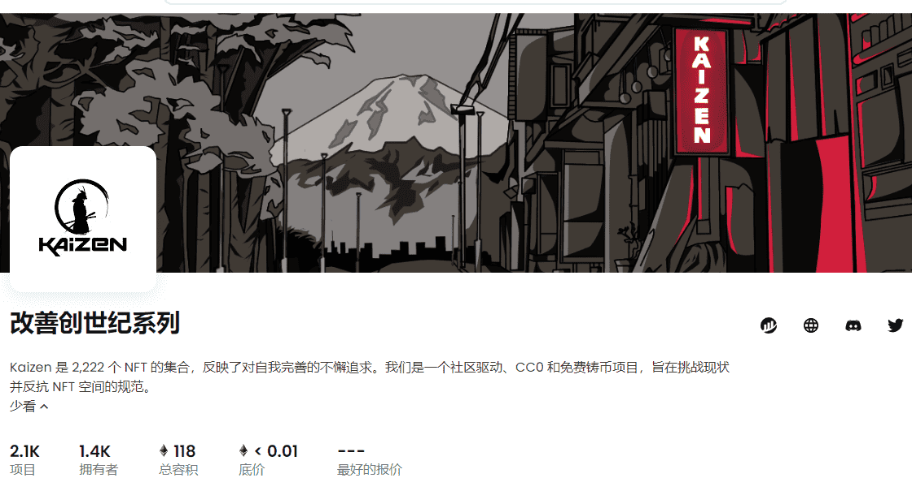

# Kaizen Genesis Collection

▶ 什么是 Kaizen Genesis Collection？
Kaizen Genesis Collection 是一个 NFT（非同质代币）集合。存储在区块链上的数字艺术品集合。
▶ 存在多少 Kaizen Genesis Collection 代币？
总共有 2,056 个 Kaizen Genesis Collection NFT。目前，1,397 名所有者的钱包中至少有一个 Kaizen Genesis Collection NTF。
▶ 最昂贵的 Kaizen Genesis Collection 销售是什么？
售出的最昂贵的 Kaizen Genesis Collection NFT 是 Kaizen #607。它于 2022-06-04（3 个月前）以 18.2 美元的价格售出。
▶ 最近卖出了多少个 Kaizen Genesis Collection？
过去 30 天内售出了 10 个 Kaizen Genesis Collection NFT。

