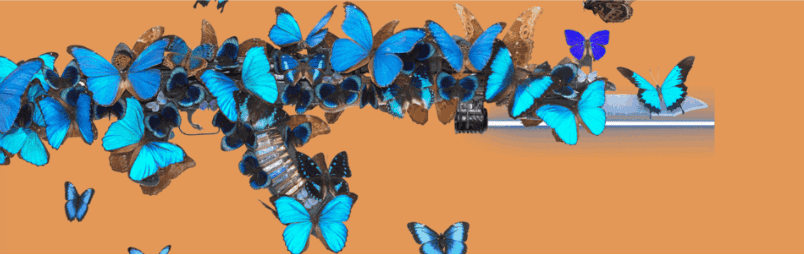

# KALASH47

欢迎来到 OpenSea 上的 KALASH47 之家。布兰·西蒙森 (Bran Symondson) 的 1047 个 NFT 合集，士兵转为雕塑家。一位以 AK47 为媒介的英国艺术家，将可以说是世界上最危险的武器变成了艺术……

KALASH47 NFT - 常见问题（FAQ）
▶ 什么是 KALASH47？
KALASH47 是一个 NFT（Non-fungible token）集合。存储在区块链上的数字艺术品集合。
▶ 有多少个 KALASH47 代币？
总共有 1,047 个 KALASH47 NFT。目前 212 位所有者的钱包中至少有一个 KALASH47 NTF。
▶ 最昂贵的 KALASH47 销售是什么？
出售的最昂贵的 KALASH47 NFT 是 Kalash47 #474。它于 2022-06-09（3 个月前）以 107.9 美元的价格售出。
▶ 最近卖出了多少KALASH47？
过去 30 天内售出了 6 个 KALASH47 NFT。
▶ 什么是流行的 KALASH47 替代品？
许多拥有 KALASH47 NFT 的用户还拥有 Stormtrooper World、 Marco Grassi Art、 Anonymous Society | NFT和 郊区朋克。

