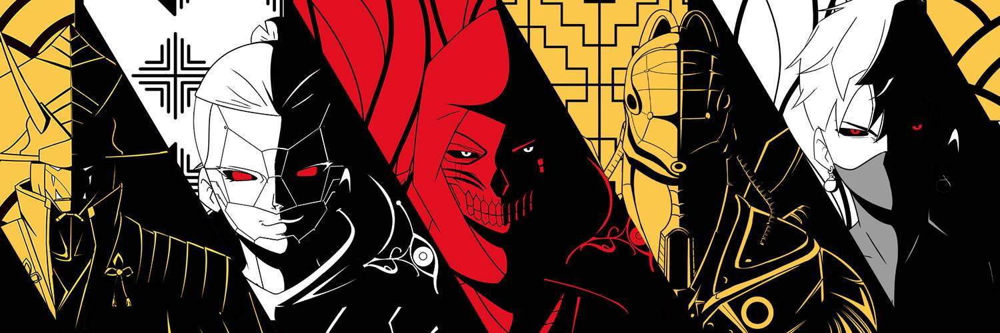

# Kamitribe Official

神灵注意到世界是空的，并产生了两个新的神灵，分别是光和仓乐。这对神圣夫妇的使命是充满世界并创造其中存在的一切。仓里率先将剑从水中拔出。从他的剑上掉下来的水滴就是我们现在所知的以太坊世界。

之后，仓良邀请光主持联合仪式。光和仓良孕育了新一代的人性化神灵。几个世纪以来，人类一直在激烈的战斗中相互厮杀。这些战斗是为了获得更多的权力和对人民的控制。正因为如此，仓加利决定割伤自己。

