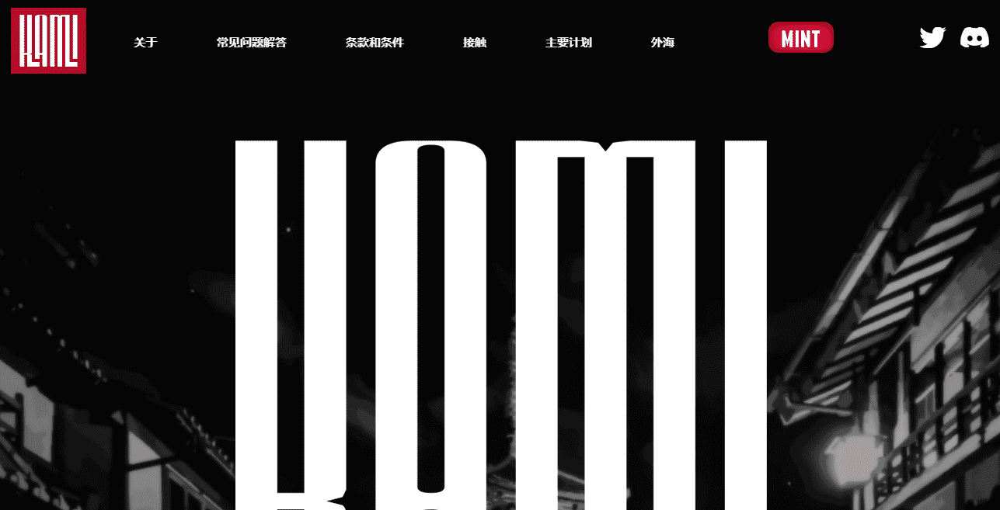

# Kamitribe

Mikaboshi，一种居住在各个领域之间的虚空中的混沌力量，因缺乏物理形式而受到折磨。Mikaboshi 永远计划进入地球领域，在经历了永恒的失败之后，它成功地打破了人类的思想。卡米出生。神明可以听到御香星的耳语，但只有一些人在听。 古代日本人将神明奉为神明。在与读美国的战争之后，他们在那里被称为人类的保护者。在那里，Kami 发现了他们非人类的能力以及在其他 Kami 手中的死亡。大战一结束，神明就意识到战争给人类带来的破坏和破坏。他们知道，世上没有比他们自己更大的威胁了。

