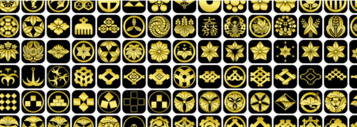

# Kamon Symbols by Hakko Daiodo

这是由 On-Chain Asset Store  提供支持的完全链上 NFT 集合之一。家纹是日本的传统，代表着每个家庭的身份。所有矢量资产均由 Hakko Daiodo创建和提供。

这是“链上资产商店”项目的一部分，该项目旨在使各种矢量资产在区块链上可用并使其可组合。详情请参见[链上 Asset Store 和 Composer]。

我们正在使用“众筹”的方法，每个铸币者支付少量的 gas 费用来将矢量图像上传到区块链，并获得多个 NFT 作为奖励。

您可以看到铸币者已经上传到区块链的矢量资产列表。请选择“组”和“类别”，然后单击下面的图像之一。它将解释如何访问矢量数据。

