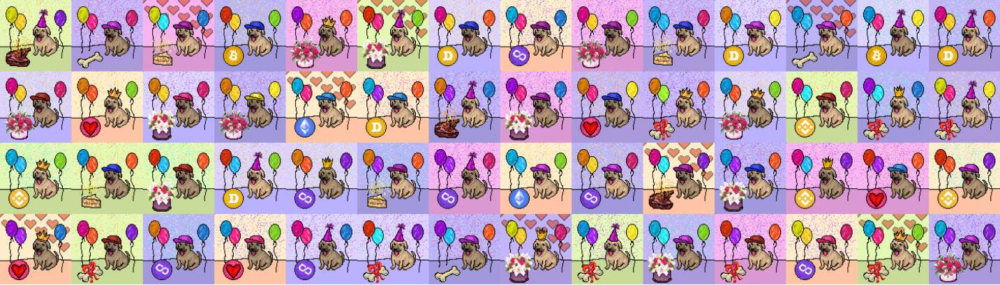

# Kangal One Year Anniversary

一个构建终极 dApps 生态系统的 DAO

生态系统将由仅通过质押铸造的实用代币 $TEAK 提供支持

Kangal 一周年 NFT - 常见问题（FAQ）
▶ 什么是 Kangal 一周年纪念日？
Kangal 一周年纪念日是一个 NFT（非同质代币）系列。存储在区块链上的数字艺术品集合。
▶ 有多少个 Kangal 一周年纪念币？
总共有 150 个 Kangal 一周年 NFT。目前 8 位所有者的钱包中至少有一个 Kangal 一周年 NTF。
▶ 最近卖出了多少个 Kangal 一周年？
过去 30 天内售出 0 个 Kangal 一周年 NFT。

