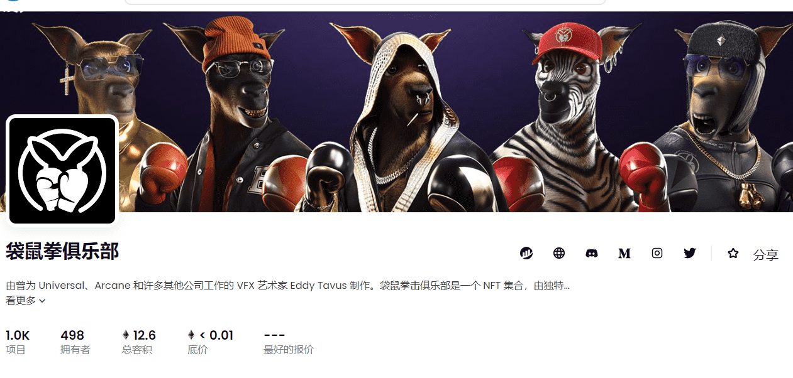

# Kangaroo Punch Club

袋鼠拳击俱乐部是一个 NFT 集合，由独特的 3D 角色组成，在以太坊区块链上具有各种复杂的独特特征。每个 NFT 都包含实用程序。Kangaroo Punch Club NFT 不仅仅是一款酷炫的 PFP，它还将作为我们不断扩展的 Metaverse Game Kangaroo Punch Arena（2022 年第二季度）中的独家可玩格斗家

▶ 什么是袋鼠拳俱乐部？
Kangaroo Punch Club 是一个 NFT（非同质代币）系列。存储在区块链上的数字艺术品集合。
▶ Kangaroo Punch Club 代币有多少？
总共有 1,022 个 Kangaroo Punch Club NFT。目前，498 位车主的钱包里至少有一个 Kangaroo Punch Club NTF。

