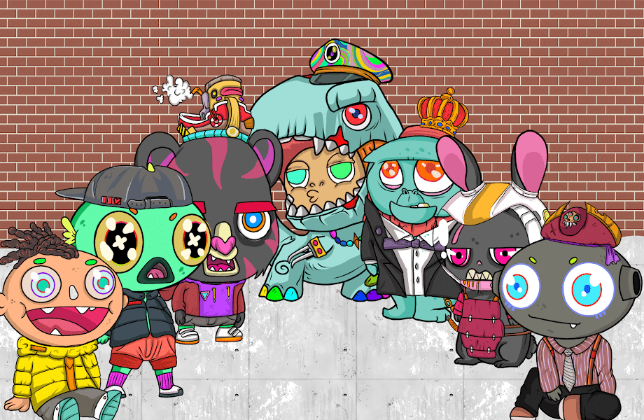

# KaraKids

KaraKids 是 5,555 个生活在以太坊区块链上的集合

KaraKids NFT - 常见问题（FAQ）
▶ 什么是 KaraKids？
KaraKids 是一个 NFT（不可替代令牌）集合。存储在区块链上的数字艺术品集合。
▶ 有多少个 KaraKids 代币？
总共有 5,555 个 KaraKids NFT。目前 583 位车主的钱包中至少有一个 KaraKids NTF。
▶ 最近卖出了多少个 KaraKids？
过去 30 天内售出 0 个 KaraKids NFT。
▶ 什么是流行的 KaraKids 替代品？
许多拥有 KaraKids NFT 的用户还拥有 The Buildoors、 Official Pickle Frens、 OrientalDragonz和 Wrapped Pixereum。

