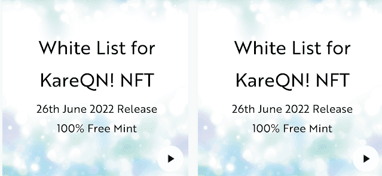

# KareQN WhiteList NFT

KareQN 白名单 NFT NFT - 常见问题（FAQ）
▶ 什么是 KareQN 白名单 NFT？
KareQN WhiteList NFT 是一个 NFT（Non-fungible token）集合。存储在区块链上的数字艺术品集合。
▶ 存在多少个 KareQN WhiteList NFT 代币？
总共有 400 个 KareQN WhiteList NFT NFT。目前，291 位所有者的钱包中至少有一个 KareQN WhiteList NFT NTF。
▶ 最昂贵的 KareQN WhiteList NFT 销售是什么？
最贵的 KareQN WhiteList NFT NFT 是 KareQN 的白名单！NFT #126。它于 2022-06-18（2 个月前）以 16.5 美元的价格售出。
▶ 最近卖出了多少 KareQN WhiteList NFT？
过去 30 天内售出了 26 个 KareQN WhiteList NFT NFT。
▶ KareQN WhiteList NFT 的费用是多少？
过去 30 天，最便宜的 KareQN WhiteList NFT NFT 销售额低于 5 美元，最高销售额超过 10 美元。KareQN WhiteList NFT NFT 的中位价格在过去 30 天内为 5 美元。
▶ 有哪些流行的 KareQN WhiteList NFT 替代品？
许多拥有 KareQN WhiteList NFT NFT 的用户还拥有 CatDinosaurRangers[SamuraiZoo2nd]、 abater 副本集合、 Rage Suits和 SHIBERU 7。

