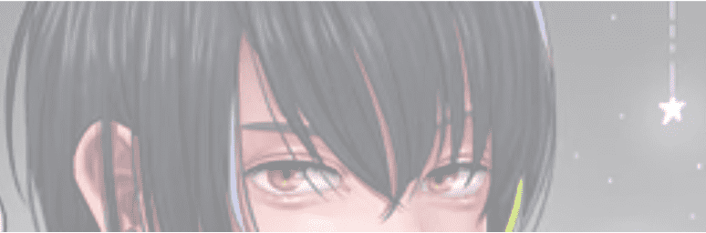

# KareQN! with all my heart

卡瑞QN！全心全意 NFT - 常见问题（FAQ）
▶ 什么是 KareQN！一心一意？
卡瑞QN！我全心全意地收藏一个 NFT（不可替代令牌）。存储在区块链上的数字艺术品集合。
▶ 多少KareQN！与我所有的心信物存在吗？
总共有 1,000 个 KareQN！我全心全意地 NFT。目前 304 位车主至少拥有一台 KareQN！我全心全意地把 NTF 放在他们的钱包里。
▶ 什么是最贵的 KareQN！我全心全意出售？
最贵的KareQN！我全心全意出售的 NFT 是 KareQN！第845章 它于 2022 年 6 月 26 日（2 个月前）以 54.9 美元的价格售出。
▶ 多少KareQN！最近全心全意卖掉了？
有 145 个 KareQN！在过去的 30 天内，我全心全意地出售了 NFT。
▶ KareQN 多少钱！付出我所有的心血？
最近30天最便宜的KareQN！我全心全意地 NFT 销售额低于 10 美元，最高销售额超过 33 美元。KareQN 的中位数价格！在过去的 30 天里，我全心全意地 NFT 是 22 美元。
▶什么是流行的KareQN！有我所有的选择吗？
许多拥有 KareQN 的用户！我全心全意地 NFT 还拥有 BaQN The Voice， 做一个绅士， Terra Firma。和 仙女座迷失的孩子：CYNQUE 原型。

