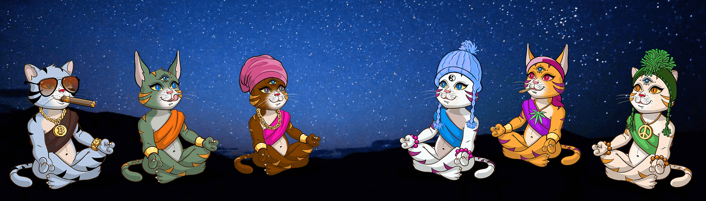

# Karma Cats NFT

所有持有者均可免费获得 3D 业力猫。

Karma Cats 正在打造首个由持有人所有的瑜伽静修和生活方式服装品牌。5,555 只受到精神启发的猫，提高了集体振动。100% 手绘原创艺术。14 种不同的毛皮，每种毛皮代表基于精神原则的不同社区派系。你是战士吗？建筑师？天使？德根？反叛？我们迫不及待地想知道。

加入我们渴望各种财富的全心全意朋友的快乐社区。我们一起无私地为世界服务并从中获利。

欢迎回家灵魂家庭。

Karma Cats NFT NFT - 常见问题（FAQ）
▶ 什么是 Karma Cats NFT？
Karma Cats NFT 是一个 NFT（不可替代代币）集合。存储在区块链上的数字艺术品集合。
▶ 有多少 Karma Cats NFT 代币？
总共有 5,550 个 Karma Cats NFT NFT。目前，1,496 名所有者的钱包中至少有一个 Karma Cats NFT NTF。
▶ 最昂贵的 Karma Cats NFT 销售是什么？
最昂贵的 Karma Cats NFT NFT 是 Karma Cat Genesis。它于 2022-06-05（3 个月前）以 94.6 美元的价格售出。
▶ 最近卖出了多少 Karma Cats NFT？
过去 30 天内售出了 232 个 Karma Cats NFT NFT。
▶ Karma Cats NFT 需要多少钱？
过去 30 天，Karma Cats NFT NFT 最便宜的销售额低于 11 美元，最高销售额超过 36 美元。过去 30 天，Karma Cats NFT NFT 的中位价格为 27 美元。
▶ 什么是流行的 Karma Cats NFT 替代品？
许多拥有 Karma Cats NFT NFT 的用户还拥有 PharaGoddess-NFT、 PharaGods-NFT、 Mythicals Origins和 Big Brain Kids V2。

