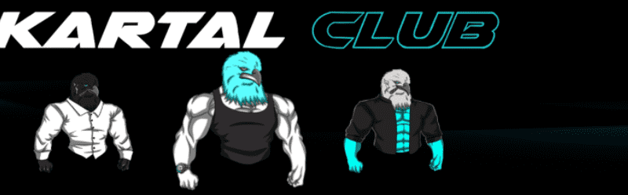

# KARTAL CLUB

KARTAL CLUB NFT - 常见问题（FAQ）
▶ 什么是 KARTAL 俱乐部？
KARTAL CLUB 是一个 NFT（Non-fungible token）集合。存储在区块链上的数字艺术品集合。
▶ 有多少 KARTAL CLUB 代币？
总共有 502 个 KARTAL CLUB NFT。目前，368 位车主的钱包中至少有一个 KARTAL CLUB NTF。
▶ 什么是最昂贵的 KARTAL CLUB 销售？
售出的最昂贵的 KARTAL CLUB NFT 是 Kartal Club #0186。它于 2022-06-07（3 个月前）以 616.7 美元的价格售出。
▶ 最近卖出了多少KARTAL CLUB？
过去 30 天内售出了 15 个 KARTAL CLUB NFT。
▶ KARTAL CLUB 的费用是多少？
过去 30 天，最便宜的 KARTAL CLUB NFT 销售额低于 237 美元，最高销售额超过 575 美元。过去 30 天内，KARTAL CLUB NFT 的中位价格为 472 美元。
▶ 什么是流行的 KARTAL CLUB 替代品？
许多拥有 KARTAL CLUB NFT 的用户还拥有 GoBMaN WuZ HeRe by Val Kilmer X Remo、 Babylon Misfits、 Born To Be Me Genesis和 AI HUMANS COLLECTION。

