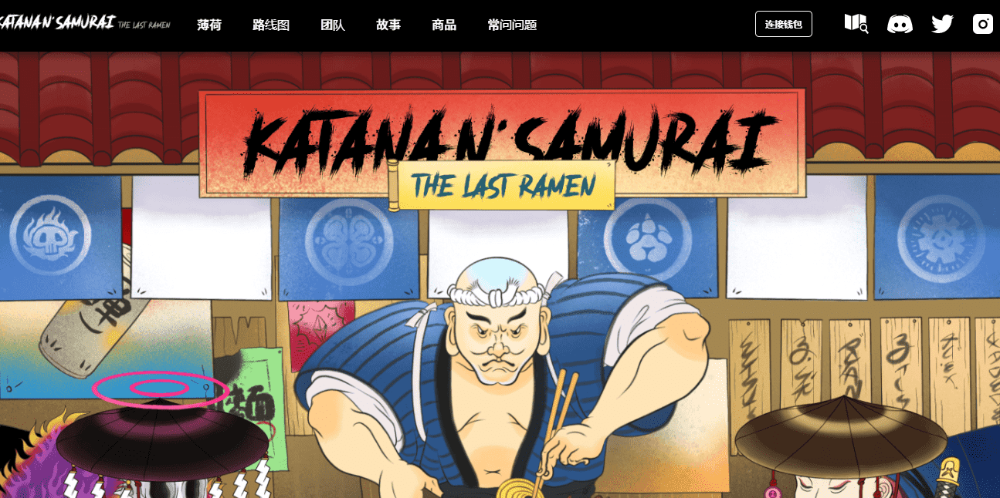

# Katana N Samurai 2

Katana N Samurai : 最后的拉面，在以太坊网络上存储和运行。浮世绘是 1700 年代日本著名的传统艺术，我们的目标是将这种历史艺术带入整个 NFT 市场并传播日本文化。此外，为了让这里成为一个可持续和互动的社区，KNS: The Last Ramen 最终将建立社区宝库，并将 KNS 构建成一个可持续的生态系统。总而言之，欢迎来到 Samuraiverse！加入我们的 Discord 并关注我们的 Twitter，成为 KNS 社区的一员！

