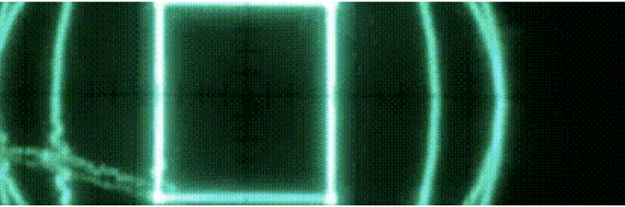

# Kate the Cursed 13 Editions

Katherina “Kate the Cursed” Jesek（生于 1999 年）是一位来自纽约市郊区的多媒体数字艺术家和跨性别活动家。她的作品专注于真实的、过时的显示技术，大量使用阴极射线管以及最近的老式示波器。

被诅咒的凯特 13 版 NFT - 常见问题（FAQ）
▶ 什么是被诅咒的凯特 13 版？
Kate the Cursed 13 Editions 是一个 NFT（不可替代代币）系列。存储在区块链上的数字艺术品集合。
▶ 被诅咒的凯特 13 版代币有多少？
总共有 11 个 Kate the Cursed 13 Editions NFT。目前，94 位所有者的钱包中至少有一个 Kate the Cursed 13 Editions NTF。
▶ 最近卖出了多少被诅咒的凯特 13 版？
过去 30 天内售出 0 个 Kate the Cursed 13 Editions NFT。

