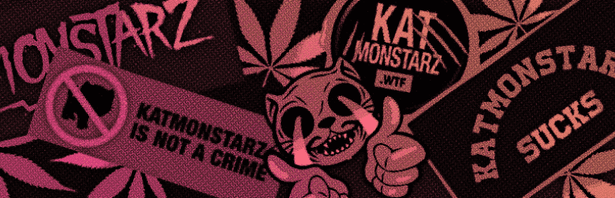

# KatMonstarz

Katmonstarz 是一个社区驱动的收藏品项目，收藏规模为 2,500 个，每个 Katmonstarz 允许其所有者投票、获得 nft 掉落和收入。加入 Kat 包。

很久以前，猫和星星在以太坊上和睦相处。 发生了一些可怕的事情，为了让猫们安全，Stars 把它们送到了 Polygon。
但为时已晚，cat 变成了 Katmonstarz，Stars 变成了 Playmonstarz。
多年来，Katmonstarz 和 Playmonstarz 分开了，但一位勇敢的 Katmonstrarz 出生在以太坊并由 Playmonstarz 抚养长大，并被训练并被派往 Polygon 去拯救 Katmonstarz。
现在每个人都在以太坊上。
但他们还没有团聚。
以太坊是一个危险的星球，统一之前有很多陷阱和危险。

