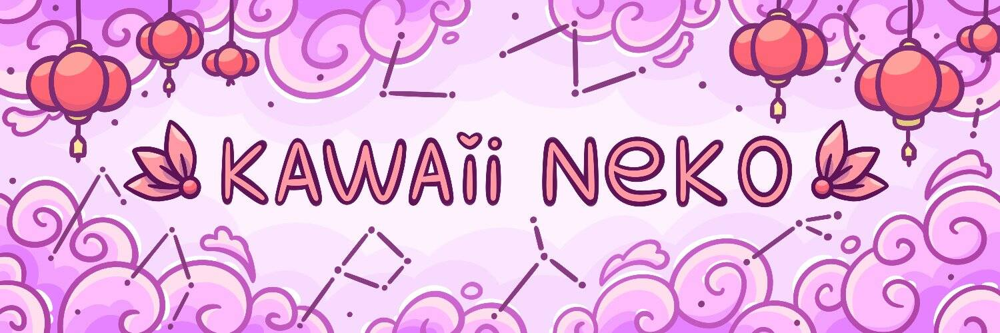

# Kawaii Neko Official

没有比卡哇伊猫更可爱的了！这些猫拥有可爱的小身体和柔软的爪子，可以保护主人免受负能量的伤害并带来好运。每只猫都是独一无二的，并且 100% 归您所有。Kawaii Neko 由 150 多个手绘特征生成，生活在以太坊区块链上，将永远为您服务。

Kawaii Neko 官方 NFT - 常见问题（FAQ）
▶ 什么是可爱猫官方？
Kawaii Neko Official 是一个 NFT（非同质代币）集合。存储在区块链上的数字艺术品集合。
▶ Kawaii Neko 官方代币有多少？
总共有 5,549 个 Kawaii Neko 官方 NFT。目前，981 位所有者的钱包中至少有一个 Kawaii Neko Official NTF。
▶ Kawaii Neko Official Sale 最贵的是什么？
出售的最昂贵的 Kawaii Neko Official NFT 是 Kawaii Neko #4420。它于 2022 年 6 月 22 日（2 个月前）以 1.1 美元的价格出售。
▶ 最近卖出了多少Kawaii Neko Official？
过去 30 天内共售出 1 个 Kawaii Neko 官方 NFT。
▶ 什么是流行的 Kawaii Neko Official 替代品？
许多拥有 Kawaii Neko Official NFTs 的用户还拥有 Autistic Buddies、 SubstandardNFTs、 Ciphersquares Official和 Bored Ape Seeks Yacht Club #0。

