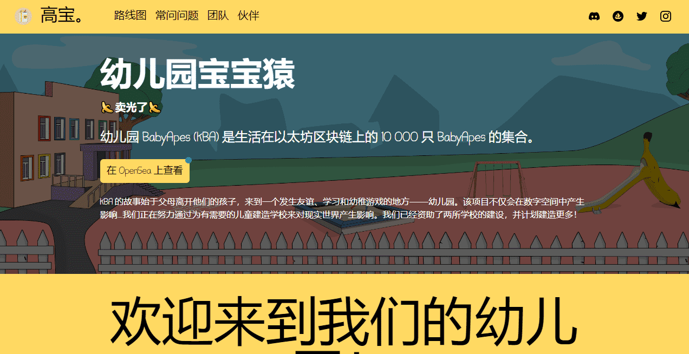

# Kindergarten BabyApes (KBA)

再建五所学校！- 20% 的版税用于在世界各地建造更多学校。幼儿园 BabyApes (KBA) 是生活在以太坊区块链上的 10,000 只 BabyApes 的集合。

KBA 的故事始于父母离开他们的孩子，来到一个发生友谊、学习和幼稚游戏的地方——幼儿园。该项目不仅会在数字空间中产生影响......我们正在努力通过为有需要的儿童建造学校来对现实世界产生影响。我们已经资助了两所学校的建设，并计划建造更多！

