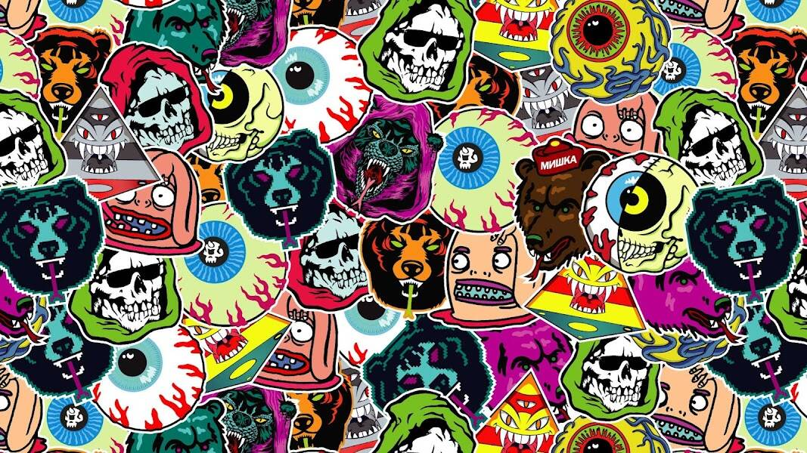

# Keep Watch Crew

Keep Watch Crew (KWC) 是 1269 个（合同无限期暂停）独一无二的 Keep Watch 眼球 NFT 的集合。每一个都是独一无二的，正如名字所述，收集这个项目会让你成为 Keep Watch Crew 的一员。除了拥有自己的 Keep Watch 之外，您还将成为 Mishka 下一章的一部分 - 进入 MISHKAVERSE 的航程以及会员资格带来的所有特权。

Keep Watch Crew NFT - 常见问题（FAQ）
▶ 什么是 Keep Watch Crew？
Keep Watch Crew 是一个 NFT（不可替代令牌）集合。存储在区块链上的数字艺术品集合。
▶ 有多少 Keep Watch Crew 代币？
总共有 1,269 个 Keep Watch Crew NFT。目前，684 位车主的钱包中至少有一个 Keep Watch Crew NTF。
▶ Keep Watch Crew 最昂贵的促销活动是什么？
售出的最昂贵的 Keep Watch Crew NFT 是 Keep Watch Crew #79。它于 2022-06-07（3 个月前）以 163 美元的价格售出。
▶ 最近卖出了多少 Keep Watch Crew？
过去 30 天内共售出 24 个 Keep Watch Crew NFT。
▶ Keep Watch Crew 的费用是多少？
在过去 30 天里，最便宜的 Keep Watch Crew NFT 销售额低于 24 美元，最高销售额超过 94 美元。在过去 30 天内，Keep Watch Crew NFT 的中位价格为 37 美元。
▶ 什么是流行的 Keep Watch Crew 替代品？
许多拥有 Keep Watch Crew NFT 的用户还拥有 CCC Genesis Packaging-Ganji、 Milan Quadens 的“LOVE”、 Siren of the Sea NFT和 Pixie Jars Rewards。

