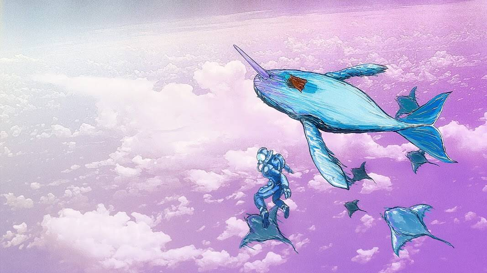

# KEK Museum of History And Future

Kekistanian 历史与未来博物馆收藏了过去 Kekistanian 学者最近发现的艺术品。Pepe 每次去 Kekistan 都会循环发现碎片。这种艺术以 NFT 的形式永远不变，具有不同程度的权力和稀有性。在您购买之前，请确保 NFT 的创建者是来自 Rpepe 项目的 Jonsnack。

KEK 历史与未来博物馆 NFT - 常见问题（FAQ）
▶ 什么是 KEK 历史与未来博物馆？
KEK 历史与未来博物馆是一个 NFT（非同质代币）收藏。存储在区块链上的数字艺术品集合。
▶ 有多少 KEK 历史与未来博物馆代币？
总共有 20 个 KEK 历史和未来 NFT 博物馆。目前，274 位业主的钱包中至少有一个 KEK 历史与未来博物馆 NTF。
▶ 最昂贵的 KEK 历史与未来博物馆拍卖会是什么？
售出的最昂贵的 KEK 历史和未来 NFT 博物馆是 KektitanX：KEK 工业的 DAO 太空船。首次登月任务 Ver. （袖珍版）。它于 2022-08-15（13 天前）以 26.7 美元的价格售出。
▶ KEK 历史与未来博物馆最近卖出了多少？
过去 30 天内售出了 1 个 KEK 历史与未来 NFT 博物馆。

