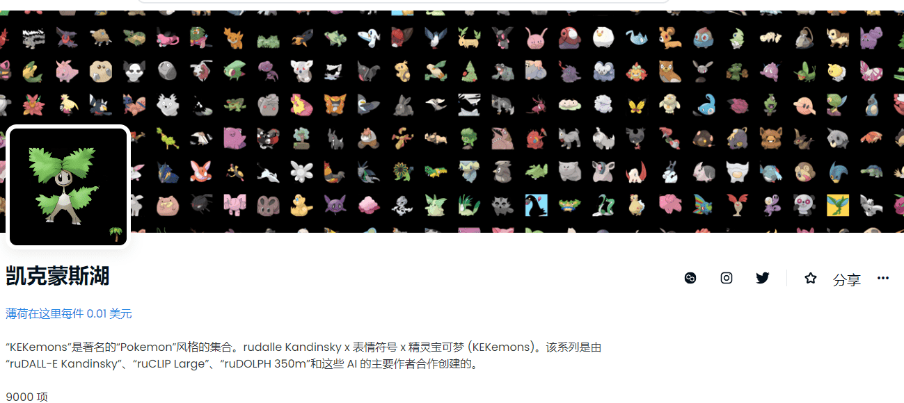

# Kekemons

rudalle Kandinsky x 表情符号 x 精灵宝可梦 (KEKemons)。该系列是由“ruDALL-E Kandinsky”、“ruCLIP Large”、“ruDOLPH 350m”和这些 AI 的主要作者合作创建的。

▶ 什么是 Kekemons-Lake？
Kekemons-Lake 是一个 NFT（Non-fungible token）集合。存储在区块链上的数字艺术品集合。
▶ 有多少 Kekemons-Lake 代币？
总共有 342 个 Kekemons-Lake NFT。目前，45 位车主的钱包中至少有一个 Kekemons-Lake NTF。
▶ 最近卖出了多少Kekemons-Lake？
过去 30 天内共售出 0 个 Kekemons-Lake NFT。

