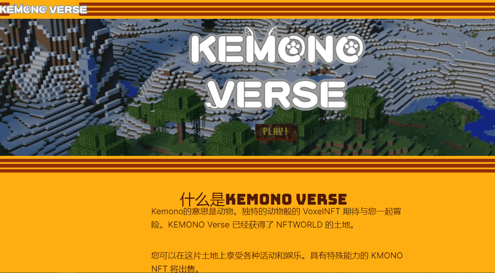

# KemonoVerse

什么是KEMONO VERSE，Kemono的意思是动物。独特的动物般的 VoxelNFT 期待与您一起冒险。KEMONO Verse 已经获得了 NFTWORLD 的土地。您可以在这片土地上享受各种活动和娱乐。具有特殊能力的 KMONO NFT 将出售。您还可以使用默认头像免费玩游戏。

▶ 什么是 KemonoVerse？
KemonoVerse 是一个 NFT（不可替代令牌）集合。存储在区块链上的数字艺术品集合。
▶ 有多少 KemonoVerse 代币？
总共有 3,334 个 KemonoVerse NFT。目前，415 位所有者的钱包中至少有一个 KemonoVerse NTF。

