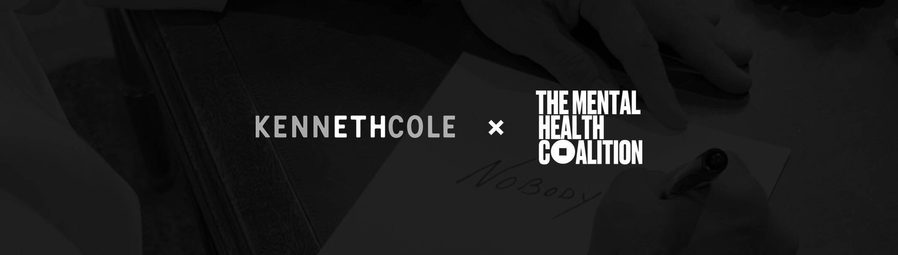

# Kenneth Cole X Mental Health Coalition

Kenneth Cole 的第一个 NFT 项目，支持心理健康联盟。独特的系列以 Kenneth 以他标志性的声音和手绘风格书写的富有影响力的信息为特色。

100% 的收益将捐赠给心理健康联盟——一项改变生活的运动，旨在结束围绕心理健康的令人衰弱的污名，并改变人们谈论和关心心理疾病的方式。这件艺术品还包括联盟的图标“圆孔中的方形钉”，象征着一种我们都可以偶尔体验的非常普遍的感觉。

Kenneth Cole X 心理健康联盟 NFT - 常见问题 (FAQ)
▶ 什么是 Kenneth Cole X 心理健康联盟？
Kenneth Cole X Mental Health Coalition 是一个 NFT（非同质代币）集合。存储在区块链上的数字艺术品集合。
▶ 存在多少 Kenneth Cole X Mental Health Coalition 代币？
总共有 8 个 Kenneth Cole X 心理健康联盟 NFT。目前，218 位业主的钱包中至少有一份 Kenneth Cole X Mental Health Coalition NTF。
▶ 最昂贵的 Kenneth Cole X Mental Health Coalition 促销活动是什么？
出售的最昂贵的 Kenneth Cole X Mental Health Coalition NFT 是 The Normal Series Tier 4。它于 2022 年 6 月 4 日（3 个月前）以 182.1 美元的价格售出。
▶ 最近卖出了多少 Kenneth Cole X Mental Health Coalition？
过去 30 天内售出了 4 个 Kenneth Cole X Mental Health Coalition NFT。
▶ 有哪些流行的 Kenneth Cole X Mental Health Coalition 替代品？
许多拥有 Kenneth Cole X Mental Health Coalition NFT 的用户还拥有 Fine ART Gallery - Claudiu Guraliuc (GC) 2022-2021 系列、 NEONFLUFS Official、 Vagrant Bulls和 All Kinds of Weirdness。

