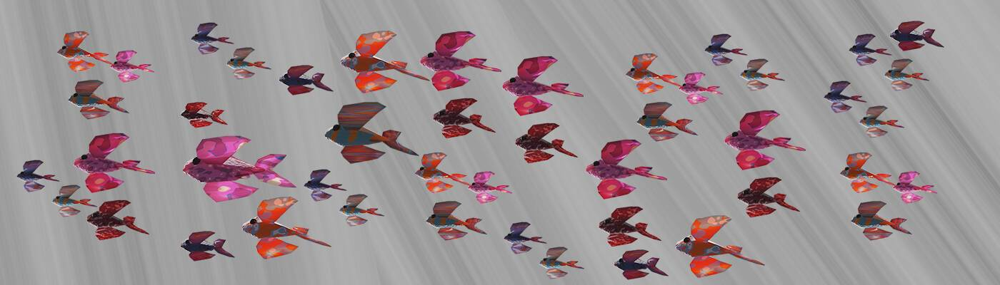

# Kenny the Koi

锦鲤肯尼统计  创建于 5 个月前  6 代币供应  5% 费用

在您设计独特的水族箱内获得各种不同形状、颜色和大小的有趣宠物鱼。

Kenny the Koi NFT - 常见问题（FAQ）
▶ 什么是锦鲤肯尼？
Kenny the Koi 是一个 NFT（不可替代令牌）集合。存储在区块链上的数字艺术品集合。
▶ 有多少个 Kenny the Koi 代币？
总共有 6 个 Kenny the Koi NFT。目前，14 位所有者的钱包中至少有一个 Kenny the Koi NTF。
▶ 最近卖出了多少只 Kenny the Koi？
过去 30 天内售出 0 个 Kenny the Koi NFT。

