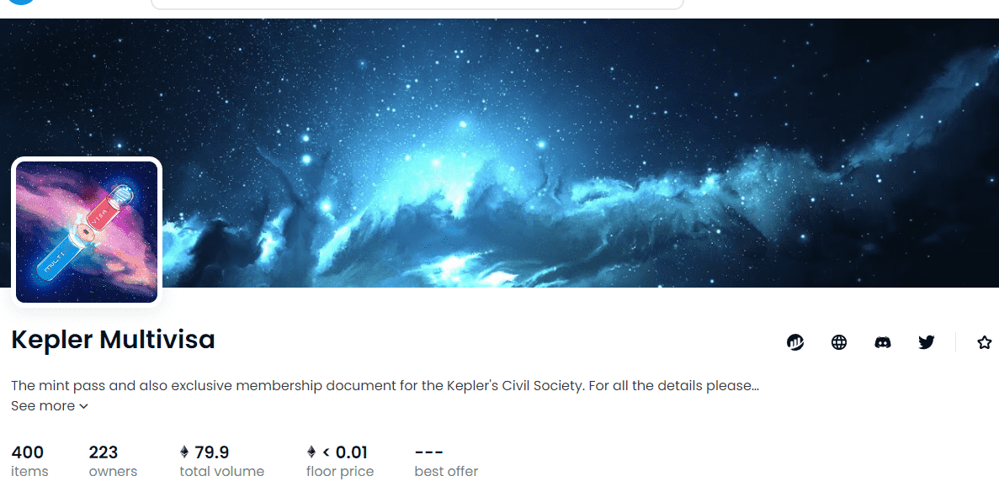

# Kepler Multivisa

服用 Multivisa 药丸，您将置身于仙境，我们将向您展示兔子洞有多深

▶ 什么是 Kepler Multivisa？
Kepler Multivisa 是一个 NFT（非同质代币）集合。存储在区块链上的数字艺术品集合。
▶ 有多少 Kepler Multivisa 代币？
总共有 400 个 Kepler Multivisa NFT。目前，223 位车主的钱包中至少有一个 Kepler Multivisa NTF。
▶ 最昂贵的 Kepler Multivisa 销售是什么？
售出的最昂贵的 Kepler Multivisa NFT 是 Kepler Multivisa #203。它于 2022-08-14（21 天前）以 0.7 美元的价格出售。
▶ 最近卖出了多少 Kepler Multivisa？
过去 30 天内售出了 1 个 Kepler Multivisa NFT。

