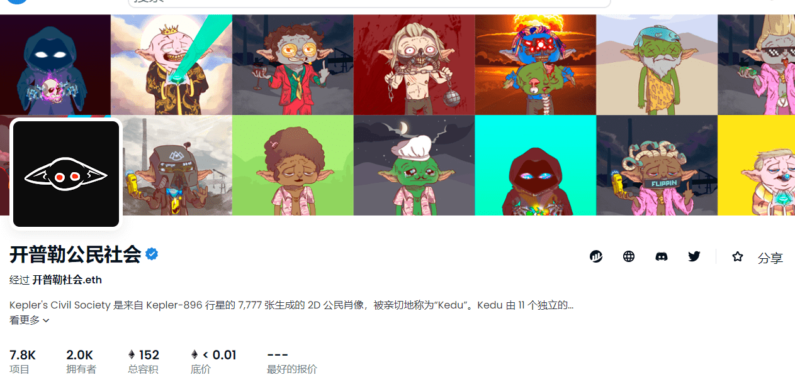

# Keplers Civil Society

开普勒公民社会，Kedu 由 11 个独立的随机类别和 300 多个手绘特征来区分。每个 Kedu 在基因上都有能力控制存在的基本宇宙能量力量。

Kedu 通常是友好的生物，但有传言称，在 Kepler 废弃的神殿的某个地方，正在创建一个 Dark Kedu 联盟......选择你将参加哪一方与 Light v Dark 的战斗。所有持有 Kedu 的钱包都有资格获得空投和独家访问/输入所有新收藏和元界“土地”扩展，主要在 Discord 上讨论。

