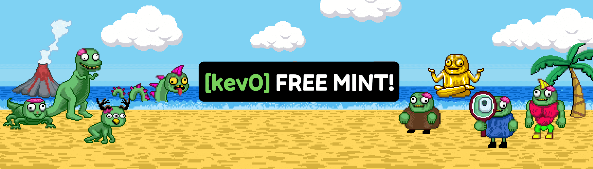

# kev0 (polygon)

Kev0 是一个独特的全链 NFT 集合，由 4004 个僵尸妖精组成，基于 KEVoLUTION 链游戏。

kev0（多边形）NFT - 常见问题（FAQ）
▶ 什么是 kev0（多边形）？
kev0（多边形）是一个 NFT（非同质代币）集合。存储在区块链上的数字艺术品集合。
▶ 有多少个kev0（多边形）代币？
总共有 915 个 kev0（多边形）NFT。目前 238 位所有者的钱包中至少有一个 kev0（多边形）NTF。
▶ 最近卖了多少kev0（多边形）？
过去 30 天内售出了 0 个 kev0（多边形）NFT。
▶ 什么是流行的 kev0（多边形）替代品？
许多拥有 kev0（多边形）NFT 的用户还拥有 My Little Miner Stake Minter、 Omni Bears、 ONIPUNK和 OMBO。

