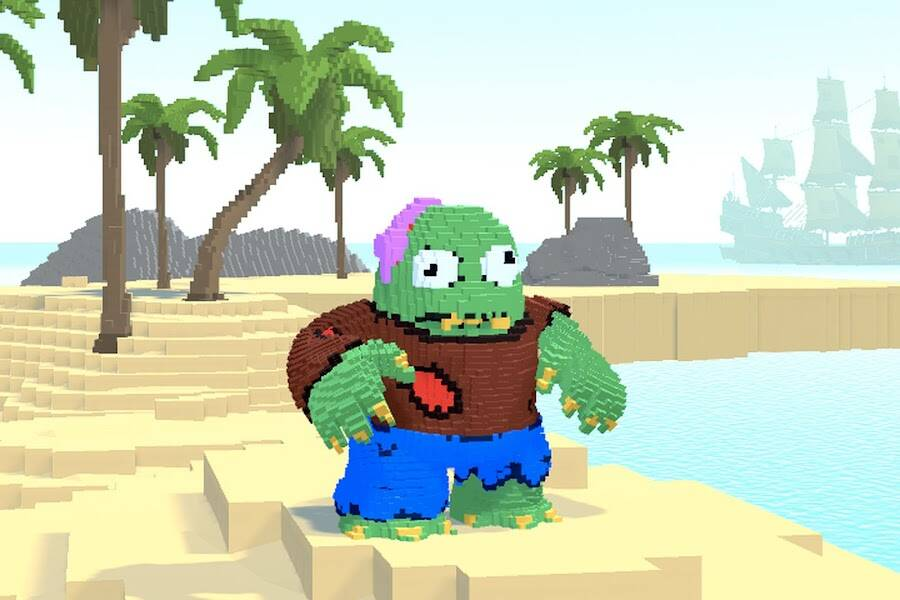

# Kevin3L

**Kevin3L 统计**

创建于 6 个月前，1,088 代币供应，7% 费用

过去 7 天没有售出任何 Kevin3L。

前 1000 个免费薄荷糖！

2000 GENESIS Kevin3Ls 美丽的艺术和传奇的 DNA 正在占领世界。它将载入后代的所有历史书籍。1 凯文3L = 1 凯文3L。IRL 获得 Kevin3L 意味着您无需接种疫苗、戴口罩、遵循交通信号灯或在餐馆小费。这是一个奇迹。

Kevin3L NFT - 常见问题（FAQ）
▶ 什么是 Kevin3L？
Kevin3L 是一个 NFT（非同质代币）集合。存储在区块链上的数字艺术品集合。
▶ 有多少 Kevin3L 代币？
总共有 1,088 个 Kevin3L NFT。目前 161 位所有者的钱包中至少有一个 Kevin3L NTF。
▶ 最近卖出了多少Kevin3L？
过去 30 天内售出 0 个 Kevin3L NFT。

