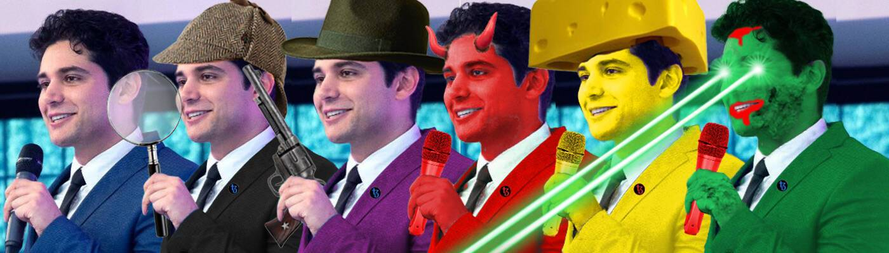

# KevinDAO

666 个生成的 NFT 来简化和庆祝我们的 Tezos 之王 KEVIN。 我们爱你，凯文，请怜悯我们，因为我们只能弄清楚如何在以太坊上铸币。 硬分叉得到了我们。5% 的版税将捐赠给 DAO 同意的慈善机构。

 KevinDAO NFT 可以免费铸造。 5% 的版税将捐赠给 DAO 同意的慈善机构。 您只需要支付汽油费。

KevinDAO NFT - 常见问题（FAQ）
▶ 什么是 KevinDAO？
KevinDAO 是一个 NFT（不可替代代币）集合。存储在区块链上的数字艺术品集合。
▶ 有多少 KevinDAO 代币？
总共有 666 个 KevinDAO NFT。目前 140 位所有者的钱包中至少有一个 KevinDAO NTF。
▶ 最近卖出了多少 KevinDAO？
过去 30 天内售出 0 个 KevinDAO NFT。
▶ 什么是流行的 KevinDAO 替代品？
许多拥有 KevinDAO NFT 的用户还拥有 Ramin Nasibov 的The Larva Crabs、 The PuzlPunks、 MRGLIN和 Circum。

