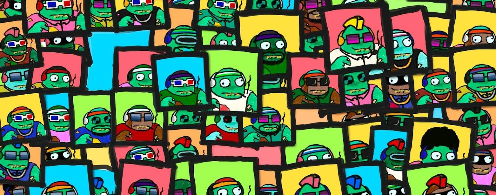

# Kevin Everyday NFT

**凯文日常 NFT 统计**

创建于 6 个月前，3,000 代币供应，5% 费用

过去 7 天没有售出 Kevin Everyday NFT。

Henlo，在内心深处，我们都是凯文，我们需要朋友。超过 300 个最初手绘的特征，没有买，kek。绝对不隶属于 Pixelmon。免费薄荷现已在 https://www.kevineveryday.com/

Kevin Everyday NFT NFT - 常见问题（FAQ）

▶ 什么是 Kevin Everyday NFT？

Kevin Everyday NFT 是一个 NFT（非同质代币）集合。存储在区块链上的数字艺术品集合。

▶ 有多少 Kevin Everyday NFT 代币？

总共有 3,000 个 Kevin Everyday NFT NFT。目前，323 位所有者的钱包中至少有一个 Kevin Everyday NFT NTF。

▶ 最近卖出了多少 Kevin Everyday NFT？

过去 30 天内售出 0 个 Kevin Everyday NFT NFT。

