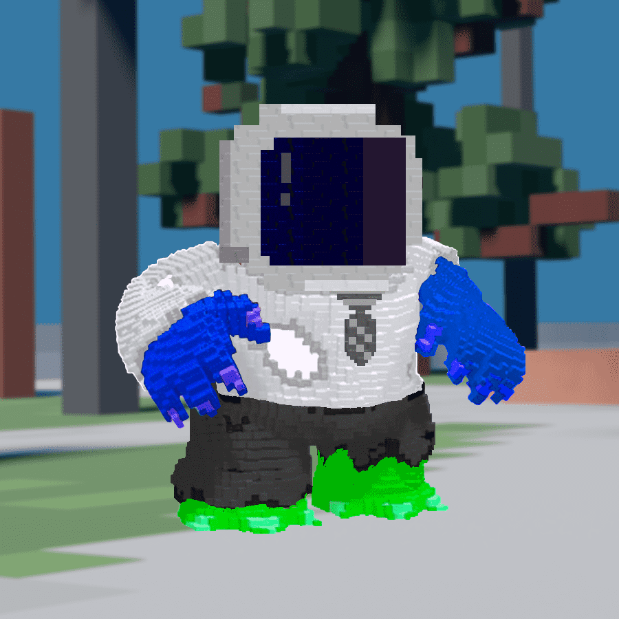

# Kevinmon

凯文是区块链上的偶像。我们是 KEV 的忠实粉丝，我们已经衍生出 6666 种 KEVIN 的变体。

凯文是区块链上的偶像。
我们是 KEV 的忠实粉丝，我们已经衍生出 6666 种 KEVIN 的变体。 请享用。
• 每笔仅 0.0069Ξ，每笔交易 10
• 凯文的 100 多个特征和 6,666 种变体
• 即时揭示
• 比 7000 万美元的项目更好（也便宜 400 倍）
• 现在薄荷

Kevinmon NFT - 常见问题（FAQ）

▶ 什么是凯文兽？

Kevinmon 是一个 NFT（非同质代币）集合。存储在区块链上的数字艺术品集合。

▶ 有多少 Kevinmon 代币？

总共有 1,905 个 Kevinmon NFT。目前，157 位车主的钱包中至少有一个 Kevinmon NTF。

▶ 最近卖了多少Kevinmon？

过去 30 天内售出 0 个 Kevinmon NFT。

